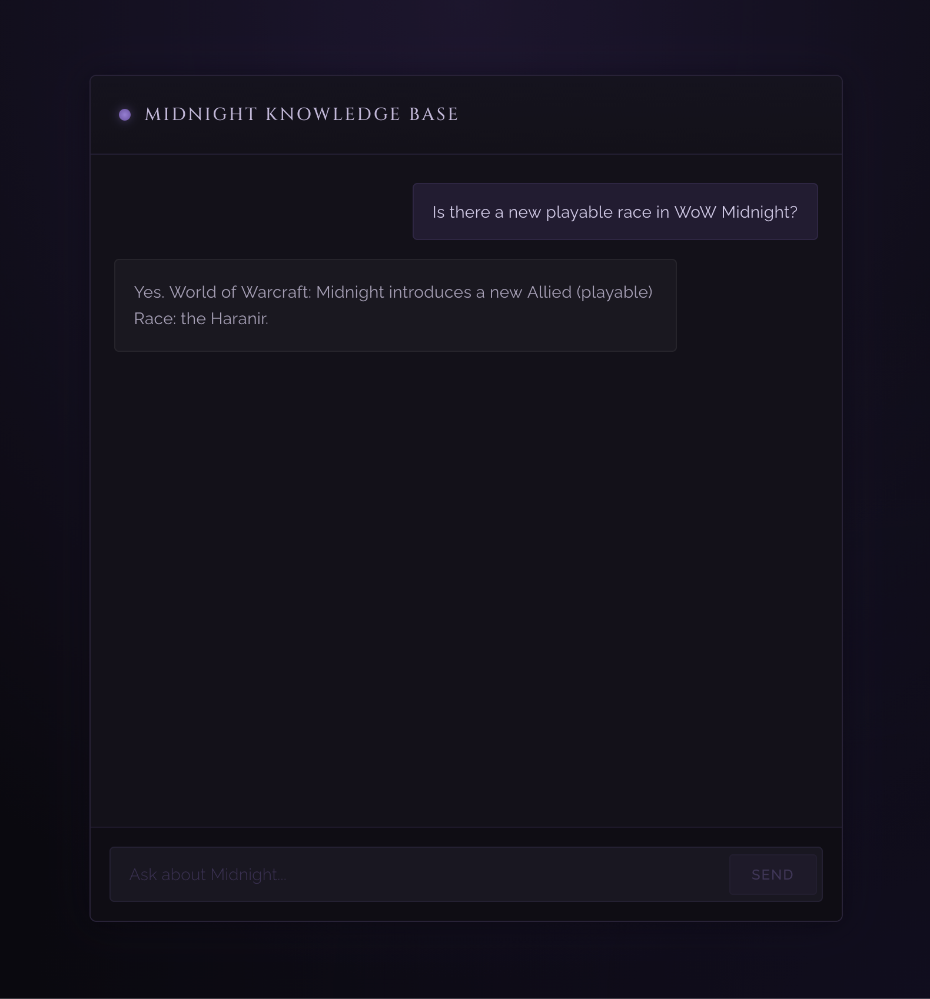
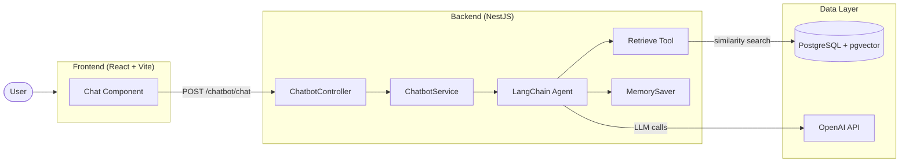
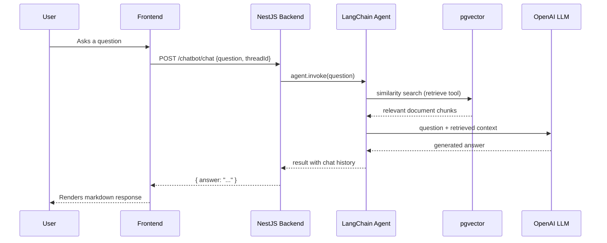

# Midnight Knowledge Base

A RAG (Retrieval-Augmented Generation) chatbot that answers questions about the World of Warcraft: Midnight expansion. Built as a learning project to explore LLM-powered applications with a full-stack TypeScript architecture.

> **Disclaimer:** This project is for educational and portfolio purposes only. All World of Warcraft content and data from [Wowhead](https://www.wowhead.com) belongs to their respective owners (Blizzard Entertainment / Wowhead). This project is not affiliated with or endorsed by them and is not intended for commercial use.



**Data source:** [Wowhead Midnight Expansion Overview](https://www.wowhead.com/guide/midnight/expansion-overview)

### Example Questions

- "What new features are coming in Midnight?"
- "What is the new playable race?"
- "What classes can the Haranir play?"
- "Tell me about the new zones in Midnight"

## Architecture



## RAG Pipeline



## Tech Stack

| Layer | Technology |
|-------|-----------|
| Frontend | React 19, TypeScript, Vite |
| Backend | NestJS, TypeScript |
| LLM Orchestration | LangChain, LangGraph |
| LLM | OpenAI GPT-5 |
| Embeddings | OpenAI text-embedding-3-small |
| Vector Store | PostgreSQL + pgvector |
| Web Scraping | Playwright |
| Markdown Rendering | react-markdown, remark-gfm |

## Features

- **RAG pipeline** - Scrapes Wowhead guides, splits into chunks, stores as embeddings, and retrieves relevant context for each question
- **Chat history** - Maintains conversation context per session using LangGraph MemorySaver with unique thread IDs
- **Markdown responses** - AI responses rendered as formatted markdown with GitHub-Flavored Markdown support
- **WoW Midnight theme** - Custom dark UI inspired by the Midnight expansion

## Getting Started

### Prerequisites

- Node.js 20+
- Docker
- OpenAI API key
- pnpm

### Setup

1. Clone the repository
   ```bash
   git clone https://github.com/AdamBess/midnight-knowledge-base.git
   cd rag-chatbot
   ```

2. Configure environment variables
   ```bash
   cp .env.example .env
   # Edit .env with your credentials
   ```

3. Start the database
   ```bash
   docker compose up -d
   ```

4. Install dependencies
   ```bash
   pnpm install
   ```

5. Start the backend
   ```bash
   cd backend
   pnpm start:dev
   ```

6. Ingest data (one-time)
   ```bash
   curl -X POST http://localhost:3000/chatbot/ingest
   ```

6. Start the frontend
   ```bash
   cd frontend
   pnpm dev
   ```

7. Open http://localhost:5173

## What I Learned

- Building a RAG pipeline from scratch (scraping, chunking, embedding, retrieval)
- Integrating LangChain agents with tool-calling and system prompts
- Managing conversational state with LangGraph checkpointers
- Connecting a React frontend to a NestJS backend
- Working with PostgreSQL vector extensions for similarity search
